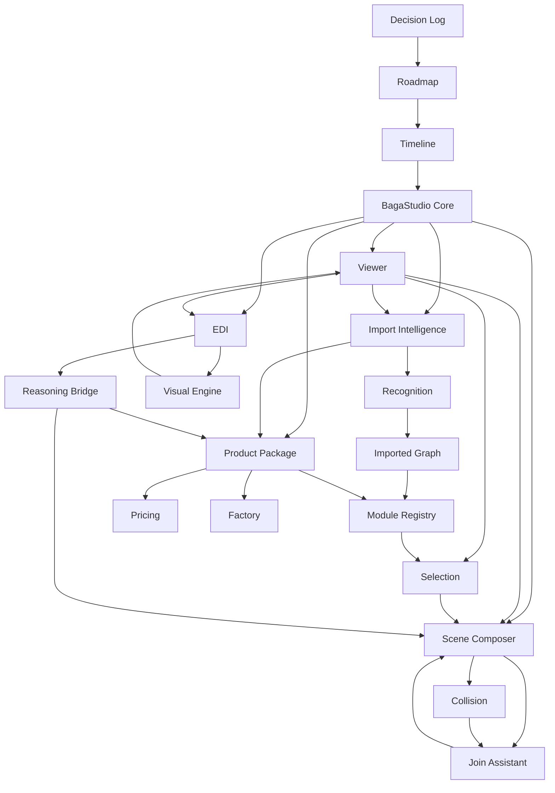
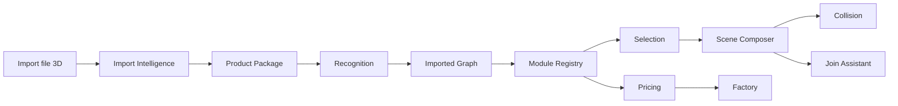
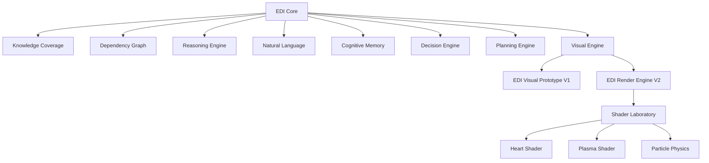

# 20 - Engine Relationship Map

Questo documento mappa le relazioni tra gli Engine ricostruiti nell'Historical Archive. Usare insieme a [22_ENGINE_DEPENDENCIES.md](22_ENGINE_DEPENDENCIES.md), [21_DECISION_TO_ENGINE_MATRIX.md](21_DECISION_TO_ENGINE_MATRIX.md) e [26_MASTER_INDEX.md](26_MASTER_INDEX.md).

## Mappa generale degli Engine

## Pipeline tecnica principale

## Layer EDI

## Relazioni documentali

- Viewer: [04_VIEWER_HISTORY.md](04_VIEWER_HISTORY.md), [11_VIEWER_RECOVERY_FOUNDATION.md](11_VIEWER_RECOVERY_FOUNDATION.md)
- Import Intelligence: [05_IMPORT_PRODUCT_PACKAGE_HISTORY.md](05_IMPORT_PRODUCT_PACKAGE_HISTORY.md), [12_IMPORT_INTELLIGENCE_HISTORY.md](12_IMPORT_INTELLIGENCE_HISTORY.md)
- Recognition / Imported Graph: [13_RECOGNITION_INTELLIGENCE_HISTORY.md](13_RECOGNITION_INTELLIGENCE_HISTORY.md)
- Product Package: [14_PRODUCT_PACKAGE_HISTORY.md](14_PRODUCT_PACKAGE_HISTORY.md)
- Scene Composer / Collision / Join: [06_SCENE_COMPOSER_COLLISION_JOIN_HISTORY.md](06_SCENE_COMPOSER_COLLISION_JOIN_HISTORY.md)
- Pricing / Factory: [15_PRICING_FACTORY_HISTORY.md](15_PRICING_FACTORY_HISTORY.md)
- EDI / Visual Engine: [07_EDI_HISTORY.md](07_EDI_HISTORY.md), [16_EDI_VISUAL_ENGINE_HISTORY.md](16_EDI_VISUAL_ENGINE_HISTORY.md)
- Decisioni: [02_DECISION_LOG.md](02_DECISION_LOG.md)
- Timeline: [17_BAGASTUDIO_TIMELINE.md](17_BAGASTUDIO_TIMELINE.md)
- Roadmap: [03_ROADMAP_EXTRACTED.md](03_ROADMAP_EXTRACTED.md)
