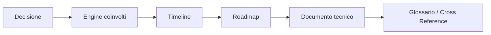

# 21 - Decision To Engine Matrix

Questa matrice collega decisioni, Engine, conversazioni e documenti. E il ponte tra [02_DECISION_LOG.md](02_DECISION_LOG.md), [03_ROADMAP_EXTRACTED.md](03_ROADMAP_EXTRACTED.md) e [17_BAGASTUDIO_TIMELINE.md](17_BAGASTUDIO_TIMELINE.md).

| Decisione | Engine coinvolti | Conversazioni | Documenti |
|---|---|---|---|
| BagaStudio Core come engine universale | Core, Viewer, Import, Product Package, Pricing, Factory, EDI | `BagaStudio Core V1` (`conversations-003.json`), `Riprendere BagaStudio Core` (`conversations-003.json`) | [02](02_DECISION_LOG.md), [03](03_ROADMAP_EXTRACTED.md), [17](17_BAGASTUDIO_TIMELINE.md), [18](18_PERMANENT_DESIGN_PRINCIPLES.md) |
| Separare BagaStudio, Libreria Morini ed Elvis | Core, Governance, Marketing/Product | `BagaStudio Core V1` (`conversations-003.json`), `Istruzioni Progetto BagaStudio` (`conversations-003.json`) | [02](02_DECISION_LOG.md), [09](09_MARKETING_PRODUCT_HISTORY.md), [18](18_PERMANENT_DESIGN_PRINCIPLES.md) |
| Sviluppo conservativo e validato | Tutti gli Engine | `Modifiche Dashboard Premium`, `Ripresa Viewer UX`, `Refactor BagaStudio V1.9`, `BagaStudio Core Step 1`, `BagaStudio Shader Laboratory` | [02](02_DECISION_LOG.md), [18](18_PERMANENT_DESIGN_PRINCIPLES.md), [19](19_PHASE2_REPORT.md) |
| Viewer come superficie stabile | Viewer, Selection, Import, Collision, Join, EDI Overlay | `Ripresa Viewer3D Multi-Loader`, `Ripresa BagaStudio Core - Recovery DAE/Viewer`, `Bug Fix Showroom Premium`, `BagaStudio Core Step 1` | [04](04_VIEWER_HISTORY.md), [11](11_VIEWER_RECOVERY_FOUNDATION.md), [20](20_ENGINE_RELATIONSHIP_MAP.md) |
| Dashboard Premium e workflow CARICA / CONFIGURA / SALVA / PRODUCI / AIUTO | Viewer, Project Save/Open, Pricing, Factory, EDI Launcher | `Modifiche Dashboard Premium`, `Ripresa BagaStudio Core - A2.5 Salva/Apri progetto` | [03](03_ROADMAP_EXTRACTED.md), [04](04_VIEWER_HISTORY.md), [17](17_BAGASTUDIO_TIMELINE.md) |
| Import multi-formato | Import Intelligence, Viewer, Product Package | `Riprendere BagaStudio Core`, `Ripresa Viewer3D Multi-Loader`, `Importer Pipeline V2 DAE` | [05](05_IMPORT_PRODUCT_PACKAGE_HISTORY.md), [12](12_IMPORT_INTELLIGENCE_HISTORY.md), [22](22_ENGINE_DEPENDENCIES.md) |
| Product Package V2 come ponte verso produzione | Product Package, Import, Recognition, Pricing, Factory | `Aggiornamento S3D Product Package`, `BagaStudio Core V2`, `BagaStudio Core Step 1` | [02](02_DECISION_LOG.md), [14](14_PRODUCT_PACKAGE_HISTORY.md), [21](21_DECISION_TO_ENGINE_MATRIX.md) |
| CSV/CIX Matcher e Auto Mapping Engine V2 | Product Package, Recognition, Factory | `BagaStudio Core V2` (`conversations-004.json`) | [05](05_IMPORT_PRODUCT_PACKAGE_HISTORY.md), [14](14_PRODUCT_PACKAGE_HISTORY.md), [24](24_RFC_ORIGIN_MAP.md) |
| Viewer Recovery prima di feature nuove | Viewer, Import, Selection, Collision, Join | `Ripresa BagaStudio Core - Recovery DAE/Viewer`, `Ripresa Viewer UX`, `BagaStudio Core Step 1` | [04](04_VIEWER_HISTORY.md), [11](11_VIEWER_RECOVERY_FOUNDATION.md), [18](18_PERMANENT_DESIGN_PRINCIPLES.md) |
| Imported Model Hierarchy V1 | Recognition, Imported Graph, Module Registry, Selection, Product Package | `BagaStudio Core Step 1` (`conversations-004.json`) | [13](13_RECOGNITION_INTELLIGENCE_HISTORY.md), [24](24_RFC_ORIGIN_MAP.md), [22](22_ENGINE_DEPENDENCIES.md) |
| Scene Composer Foundation | Scene Composer, Room, Viewer, Collision, Join | `Configurazione Ambiente V1`, `Prossimi passi V32`, `Aggiornamenti BagaStudio Core` | [06](06_SCENE_COMPOSER_COLLISION_JOIN_HISTORY.md), [17](17_BAGASTUDIO_TIMELINE.md), [20](20_ENGINE_RELATIONSHIP_MAP.md) |
| Collisione modulo-modulo e rollback | Collision, Viewer, Scene Composer, Join | `Fix trasformazione modulo`, `Stabilizzazione motore collisione` | [06](06_SCENE_COMPOSER_COLLISION_JOIN_HISTORY.md), [22](22_ENGINE_DEPENDENCIES.md) |
| Join Assistant stabilizzato | Join, Collision, Scene Composer, Viewer | `Stabilizzazione motore collisione` | [06](06_SCENE_COMPOSER_COLLISION_JOIN_HISTORY.md), [25](25_HISTORICAL_GLOSSARY.md) |
| Pricing/BOM/Factory come output tecnico | Pricing, BOM, Factory, Product Package | `Ripristino configuratore professionale`, `Roadmap e Task sviluppo`, `Knowledge Base V1.1` | [15](15_PRICING_FACTORY_HISTORY.md), [03](03_ROADMAP_EXTRACTED.md), [22](22_ENGINE_DEPENDENCIES.md) |
| EDI separato dal Canvas | EDI, Viewer, Home, Overlay | `EDI Animated Core` (`conversations-005.json`) | [07](07_EDI_HISTORY.md), [16](16_EDI_VISUAL_ENGINE_HISTORY.md), [20](20_ENGINE_RELATIONSHIP_MAP.md) |
| Non evolvere piu SVG: EDI Render Engine V2 | EDI Visual Engine, Shader Laboratory | `BagaStudio Shader Laboratory` (`conversations-005.json`) | [07](07_EDI_HISTORY.md), [16](16_EDI_VISUAL_ENGINE_HISTORY.md), [24](24_RFC_ORIGIN_MAP.md) |

## Flusso Decisione -> Timeline -> Roadmap

