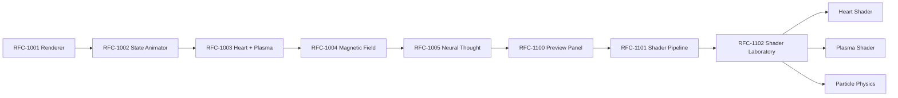

# 24 - RFC Origin Map

Mappa delle RFC esplicite e delle milestone con ruolo equivalente a RFC implicita. Collegata a [02_DECISION_LOG.md](02_DECISION_LOG.md), [03_ROADMAP_EXTRACTED.md](03_ROADMAP_EXTRACTED.md) e [17_BAGASTUDIO_TIMELINE.md](17_BAGASTUDIO_TIMELINE.md).

| RFC / Milestone | Prima comparsa | Evoluzione | Decisione finale | Documenti correlati |
|---|---|---|---|---|
| Configuratore professionale JSON-driven | `Ripristino configuratore professionale` (`conversations-003.json`) | Modelli/materiali/texture/dimensioni/pricing/assembly | Stabilizzare Viewer e scala prima delle feature | [04](04_VIEWER_HISTORY.md), [17](17_BAGASTUDIO_TIMELINE.md) |
| BagaStudio Core universale | `BagaStudio Core V1` (`conversations-003.json`) | Showcase -> Core multi-prodotto | Core come engine universale proprietario | [02](02_DECISION_LOG.md), [03](03_ROADMAP_EXTRACTED.md), [17](17_BAGASTUDIO_TIMELINE.md) |
| Viewer Recovery Foundation | `Ripresa BagaStudio Core - Recovery DAE/Viewer` (`conversations-004.json`) | Recovery -> UX Premium -> Imported Hierarchy | Viewer stabile come prerequisito | [04](04_VIEWER_HISTORY.md), [11](11_VIEWER_RECOVERY_FOUNDATION.md), [18](18_PERMANENT_DESIGN_PRINCIPLES.md) |
| Importer Pipeline V2 DAE | `Importer Pipeline V2 DAE` (`conversations-004.json`) | DAE support -> Product Package | Import come fondazione dati | [05](05_IMPORT_PRODUCT_PACKAGE_HISTORY.md), [12](12_IMPORT_INTELLIGENCE_HISTORY.md) |
| S3D Product Package V2 | `Aggiornamento S3D Product Package` (`conversations-004.json`) | S3D Runtime -> metadata -> bridge Viewer | Product Package come contratto tecnico | [14](14_PRODUCT_PACKAGE_HISTORY.md), [21](21_DECISION_TO_ENGINE_MATRIX.md) |
| Auto Mapping Engine V2 | `BagaStudio Core V2` (`conversations-004.json`) | CSV/CIX Matcher 80/80 -> Auto Mapping | Mapping produzione come passo successivo | [05](05_IMPORT_PRODUCT_PACKAGE_HISTORY.md), [14](14_PRODUCT_PACKAGE_HISTORY.md) |
| Knowledge Base V1.1 | `Knowledge Base V1.1` (`conversations-004.json`) | Constraint Engine -> Knowledge Base | Da verificare | [03](03_ROADMAP_EXTRACTED.md), [15](15_PRICING_FACTORY_HISTORY.md) |
| Smart Technical Validator V1 | `Ripresa BagaStudio Core - Smart Technical Validator / Layout Room Intelligence` (`conversations-004.json`) | Validator -> Layout/Room Intelligence | Da verificare | [15](15_PRICING_FACTORY_HISTORY.md), [19](19_PHASE2_REPORT.md) |
| RoomEnvironment Refactor | `Ripresa BagaStudio Core - RoomEnvironment Refactor` (`conversations-004.json`) | Room Materials/Textures -> Empty Room | Ambiente come fondazione Scene Composer | [06](06_SCENE_COMPOSER_COLLISION_JOIN_HISTORY.md), [17](17_BAGASTUDIO_TIMELINE.md) |
| Empty Room Premium V32 | `Prossimi passi V32` (`conversations-004.json`) | Stanza default ON -> pareti/faretti/battiscopa | Da verificare | [06](06_SCENE_COMPOSER_COLLISION_JOIN_HISTORY.md), [08](08_RENDER_MATERIAL_TEXTURE_HISTORY.md) |
| Collision Engine / Giunzioni | `Fix trasformazione modulo` (`conversations-004.json`) | Collisione modulo -> rollback/toast | Collisione come fondazione Scene Composer | [06](06_SCENE_COMPOSER_COLLISION_JOIN_HISTORY.md), [22](22_ENGINE_DEPENDENCIES.md) |
| Join Assistant | `Stabilizzazione motore collisione` (`conversations-004.json`) | posizione persistente, drag, auto-close | Join UI validata da preservare | [06](06_SCENE_COMPOSER_COLLISION_JOIN_HISTORY.md), [25](25_HISTORICAL_GLOSSARY.md) |
| Imported Model Hierarchy V1 | `BagaStudio Core Step 1` (`conversations-004.json`) | Scene -> Imported Model -> Module -> Part | Data shape non distruttivo prima della UI | [13](13_RECOGNITION_INTELLIGENCE_HISTORY.md), [18](18_PERMANENT_DESIGN_PRINCIPLES.md) |
| RFC-1001 EdiCoreRenderer Foundation | `BagaStudio Shader Laboratory` (`conversations-005.json`) | Render Engine V2 Foundation | EDI renderer dedicato | [16](16_EDI_VISUAL_ENGINE_HISTORY.md), [07](07_EDI_HISTORY.md) |
| RFC-1002 Visual State Animator | `BagaStudio Shader Laboratory` (`conversations-005.json`) | Stati visuali EDI | Visual state separato dalla logica EDI | [16](16_EDI_VISUAL_ENGINE_HISTORY.md) |
| RFC-1003 HeartCore + PlasmaEngine | `BagaStudio Shader Laboratory` (`conversations-005.json`) | cuore/plasma -> shader futuri | Fondazione visuale EDI | [16](16_EDI_VISUAL_ENGINE_HISTORY.md) |
| RFC-1004 Magnetic Field | `BagaStudio Shader Laboratory` (`conversations-005.json`) | campo magnetico -> distorsioni | Fondazione effetti EDI | [16](16_EDI_VISUAL_ENGINE_HISTORY.md) |
| RFC-1005 Neural Thought Network | `BagaStudio Shader Laboratory` (`conversations-005.json`) | rete neurale visuale -> thought pulse | Da verificare | [16](16_EDI_VISUAL_ENGINE_HISTORY.md) |
| RFC-1100 Preview Panel | `BagaStudio Shader Laboratory` (`conversations-005.json`) | `/edi-v2-preview` | Preview isolata per EDI V2 | [16](16_EDI_VISUAL_ENGINE_HISTORY.md) |
| RFC-1101 Shader Pipeline | `BagaStudio Shader Laboratory` (`conversations-005.json`) | WebGLRenderer, RenderTarget, ShaderMaterial, EffectComposer | Pipeline GPU dedicata | [16](16_EDI_VISUAL_ENGINE_HISTORY.md) |
| RFC-1102 Shader Laboratory | `BagaStudio Shader Laboratory` (`conversations-005.json`) | laboratory -> Heart/Plasma/Magnetic/Particles/Glow | Non evolvere piu SVG; usare EDI Render Engine V2 | [16](16_EDI_VISUAL_ENGINE_HISTORY.md), [07](07_EDI_HISTORY.md) |
| RFC-1214 Validation Support Builder Foundation | RFC-1214 | Validation Support Artifact -> Builder | Builder puro, stateless, senza approval/rejection/mutation | [02](02_DECISION_LOG.md), [03](03_ROADMAP_EXTRACTED.md) |
| RFC-1215 Validation Support Traceability Foundation | RFC-1215 | Validation Support Builder -> Traceability | Audit data serializzabile, senza approval/rejection/mutation | [02](02_DECISION_LOG.md), [03](03_ROADMAP_EXTRACTED.md) |
| RFC-1216 Validation Support Evaluation Foundation | RFC-1216 | Validation Support Traceability -> Evaluation | Quality data descrittiva, senza approval/rejection/mutation | [02](02_DECISION_LOG.md), [03](03_ROADMAP_EXTRACTED.md) |
| RFC-1217 Decision Support Artifact Foundation | RFC-1217 | Validation Support Evaluation -> Decision Support | Support material non autoritativo, senza Decision Engine o mutation | [02](02_DECISION_LOG.md), [03](03_ROADMAP_EXTRACTED.md) |
| RFC-1218 First Visible EDI Panel Foundation | RFC-1218 | Decision Support Foundation -> visible Viewer surface | Pannello EDI read-only, senza EDI Core runtime o mutation | [02](02_DECISION_LOG.md), [03](03_ROADMAP_EXTRACTED.md) |

## Evoluzione RFC EDI

