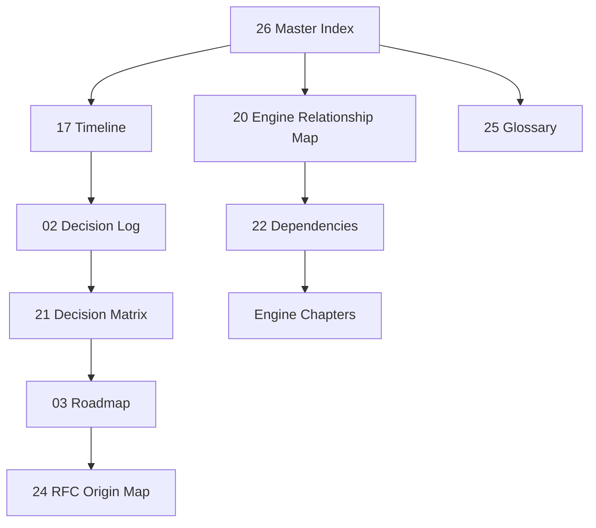

# 26 - Master Index

Punto di ingresso unico dell'Historical Archive BagaStudio Core.

## Overview

BagaStudio Core e ricostruito come piattaforma tecnico-commerciale evoluta da configuratore 3D a sistema engine-driven: Viewer, Import Intelligence, Recognition, Product Package, Scene Composer, Collision/Join, Pricing/Factory ed EDI.

Per partire:
- [17_BAGASTUDIO_TIMELINE.md](17_BAGASTUDIO_TIMELINE.md)
- [02_DECISION_LOG.md](02_DECISION_LOG.md)
- [20_ENGINE_RELATIONSHIP_MAP.md](20_ENGINE_RELATIONSHIP_MAP.md)

## Timeline

La timeline tecnica e in [17_BAGASTUDIO_TIMELINE.md](17_BAGASTUDIO_TIMELINE.md).

Milestone principali:
- Configuratore professionale e normalizzazione modello.
- BagaStudio Core universale.
- Dashboard, Import e Product Package.
- Recovery, Room e Scene Composer.
- Blueprint, Collisioni, Join e Hierarchy.
- EDI Animated Core e Shader Laboratory.

## Decision Log

Decisioni principali in [02_DECISION_LOG.md](02_DECISION_LOG.md).

Matrice decisioni-engine in [21_DECISION_TO_ENGINE_MATRIX.md](21_DECISION_TO_ENGINE_MATRIX.md).

## Roadmap

Roadmap evolutiva in [03_ROADMAP_EXTRACTED.md](03_ROADMAP_EXTRACTED.md).

La roadmap e collegata a:
- [02_DECISION_LOG.md](02_DECISION_LOG.md)
- [17_BAGASTUDIO_TIMELINE.md](17_BAGASTUDIO_TIMELINE.md)
- [24_RFC_ORIGIN_MAP.md](24_RFC_ORIGIN_MAP.md)

## Engine

| Engine | Documento |
|---|---|
| Viewer | [04_VIEWER_HISTORY.md](04_VIEWER_HISTORY.md), [11_VIEWER_RECOVERY_FOUNDATION.md](11_VIEWER_RECOVERY_FOUNDATION.md) |
| Import Intelligence | [12_IMPORT_INTELLIGENCE_HISTORY.md](12_IMPORT_INTELLIGENCE_HISTORY.md) |
| Recognition / Imported Graph | [13_RECOGNITION_INTELLIGENCE_HISTORY.md](13_RECOGNITION_INTELLIGENCE_HISTORY.md) |
| Product Package | [14_PRODUCT_PACKAGE_HISTORY.md](14_PRODUCT_PACKAGE_HISTORY.md) |
| Scene Composer / Collision / Join | [06_SCENE_COMPOSER_COLLISION_JOIN_HISTORY.md](06_SCENE_COMPOSER_COLLISION_JOIN_HISTORY.md) |
| Pricing / Factory | [15_PRICING_FACTORY_HISTORY.md](15_PRICING_FACTORY_HISTORY.md) |
| EDI | [07_EDI_HISTORY.md](07_EDI_HISTORY.md) |
| EDI Visual Engine | [16_EDI_VISUAL_ENGINE_HISTORY.md](16_EDI_VISUAL_ENGINE_HISTORY.md) |

Dipendenze complete: [22_ENGINE_DEPENDENCIES.md](22_ENGINE_DEPENDENCIES.md).

Relazioni visuali: [20_ENGINE_RELATIONSHIP_MAP.md](20_ENGINE_RELATIONSHIP_MAP.md).

## Blueprint

Documenti piu vicini al Master Blueprint:
- [02_DECISION_LOG.md](02_DECISION_LOG.md)
- [03_ROADMAP_EXTRACTED.md](03_ROADMAP_EXTRACTED.md)
- [18_PERMANENT_DESIGN_PRINCIPLES.md](18_PERMANENT_DESIGN_PRINCIPLES.md)
- [20_ENGINE_RELATIONSHIP_MAP.md](20_ENGINE_RELATIONSHIP_MAP.md)
- [22_ENGINE_DEPENDENCIES.md](22_ENGINE_DEPENDENCIES.md)

## Glossario

Glossario storico e tecnico: [25_HISTORICAL_GLOSSARY.md](25_HISTORICAL_GLOSSARY.md).

Termini chiave:
- Product Package
- Imported Graph
- Recognition
- Canvas First
- Compatibility First
- Merge Safe
- Viewer Recovery
- Join Assistant
- EDI Render Engine V2
- Shader Laboratory

## RFC

Mappa origini RFC e milestone: [24_RFC_ORIGIN_MAP.md](24_RFC_ORIGIN_MAP.md).

RFC EDI esplicite:
- RFC-1001 EdiCoreRenderer Foundation
- RFC-1002 Visual State Animator
- RFC-1003 HeartCore + PlasmaEngine
- RFC-1004 Magnetic Field
- RFC-1005 Neural Thought Network
- RFC-1100 Preview Panel
- RFC-1101 Shader Pipeline
- RFC-1102 Shader Laboratory
- RFC-1214 Validation Support Builder Foundation
- RFC-1215 Validation Support Traceability Foundation
- RFC-1216 Validation Support Evaluation Foundation
- RFC-1217 Decision Support Artifact Foundation
- RFC-1218 First Visible EDI Panel Foundation
- RFC-1219 First Real Observation Foundation
- RFC-1220 First Real Understanding Foundation
- RFC-1221 First Real Insight Foundation
- RFC-1222 Product Package Observation Summary Foundation
- RFC-1223 Focused Observation / Selection Awareness Foundation
- RFC-1224 First Context Awareness Foundation

Milestone equivalenti a RFC implicite:
- Viewer Recovery Foundation
- Importer Pipeline V2 DAE
- Product Package V2
- Imported Model Hierarchy V1
- Collision Engine / Giunzioni
- Join Assistant

## Relazioni

- Mappe Mermaid: [20_ENGINE_RELATIONSHIP_MAP.md](20_ENGINE_RELATIONSHIP_MAP.md)
- Matrice decisioni-engine: [21_DECISION_TO_ENGINE_MATRIX.md](21_DECISION_TO_ENGINE_MATRIX.md)
- Dipendenze engine: [22_ENGINE_DEPENDENCIES.md](22_ENGINE_DEPENDENCIES.md)
- Cross-reference index: [23_CROSS_REFERENCE_INDEX.md](23_CROSS_REFERENCE_INDEX.md)

## Documenti

### Archivio e sintesi
- [00_INDEX.md](00_INDEX.md)
- [01_EXECUTIVE_SUMMARY.md](01_EXECUTIVE_SUMMARY.md)
- [10_TRANSFER_PACK_NEW_ACCOUNT.md](10_TRANSFER_PACK_NEW_ACCOUNT.md)
- [19_PHASE2_REPORT.md](19_PHASE2_REPORT.md)
- [27_PHASE3_REPORT.md](27_PHASE3_REPORT.md)

### Storia tecnica
- [02_DECISION_LOG.md](02_DECISION_LOG.md)
- [03_ROADMAP_EXTRACTED.md](03_ROADMAP_EXTRACTED.md)
- [04_VIEWER_HISTORY.md](04_VIEWER_HISTORY.md)
- [05_IMPORT_PRODUCT_PACKAGE_HISTORY.md](05_IMPORT_PRODUCT_PACKAGE_HISTORY.md)
- [06_SCENE_COMPOSER_COLLISION_JOIN_HISTORY.md](06_SCENE_COMPOSER_COLLISION_JOIN_HISTORY.md)
- [07_EDI_HISTORY.md](07_EDI_HISTORY.md)
- [08_RENDER_MATERIAL_TEXTURE_HISTORY.md](08_RENDER_MATERIAL_TEXTURE_HISTORY.md)
- [09_MARKETING_PRODUCT_HISTORY.md](09_MARKETING_PRODUCT_HISTORY.md)

### Engine chapters
- [11_VIEWER_RECOVERY_FOUNDATION.md](11_VIEWER_RECOVERY_FOUNDATION.md)
- [12_IMPORT_INTELLIGENCE_HISTORY.md](12_IMPORT_INTELLIGENCE_HISTORY.md)
- [13_RECOGNITION_INTELLIGENCE_HISTORY.md](13_RECOGNITION_INTELLIGENCE_HISTORY.md)
- [14_PRODUCT_PACKAGE_HISTORY.md](14_PRODUCT_PACKAGE_HISTORY.md)
- [15_PRICING_FACTORY_HISTORY.md](15_PRICING_FACTORY_HISTORY.md)
- [16_EDI_VISUAL_ENGINE_HISTORY.md](16_EDI_VISUAL_ENGINE_HISTORY.md)
- [17_BAGASTUDIO_TIMELINE.md](17_BAGASTUDIO_TIMELINE.md)
- [18_PERMANENT_DESIGN_PRINCIPLES.md](18_PERMANENT_DESIGN_PRINCIPLES.md)

### Knowledge Base navigation
- [20_ENGINE_RELATIONSHIP_MAP.md](20_ENGINE_RELATIONSHIP_MAP.md)
- [21_DECISION_TO_ENGINE_MATRIX.md](21_DECISION_TO_ENGINE_MATRIX.md)
- [22_ENGINE_DEPENDENCIES.md](22_ENGINE_DEPENDENCIES.md)
- [23_CROSS_REFERENCE_INDEX.md](23_CROSS_REFERENCE_INDEX.md)
- [24_RFC_ORIGIN_MAP.md](24_RFC_ORIGIN_MAP.md)
- [25_HISTORICAL_GLOSSARY.md](25_HISTORICAL_GLOSSARY.md)

## Percorsi consigliati

