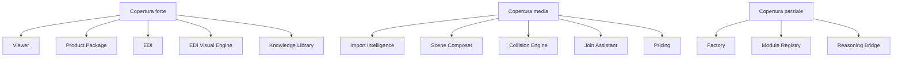

# 29 - Engine Coverage Report

## Metodo

Copertura valutata sulla documentazione storica, non sul codice. Quando un Engine e ricostruito da milestone ma non confermato da implementazione verificata, viene indicato esplicitamente.

| Engine | Prima comparsa | Milestone | Stato documentazione | Copertura | Lacune |
|---|---|---|---|---:|---|
| Viewer | `Ripristino configuratore professionale` (`conversations-003.json`) | Normalizzazione modello, selezione componenti, dashboard premium, recovery | Forte | 92% | Diff reali non inclusi; alcuni fix da verificare |
| Import Intelligence | `Riprendere BagaStudio Core` (`conversations-003.json`) | Import multi-formato, DAE Pipeline V2, S3D Runtime | Buono | 86% | Texture online e stato importer finale |
| Recognition Intelligence | `BagaStudio Core Step 1` (`conversations-004.json`) | Imported Model Hierarchy V1 | Buono ma concentrato | 82% | Implementazione effettiva data shape; algoritmo V1 |
| Imported Graph | `BagaStudio Core Step 1` (`conversations-004.json`) | Scene -> Imported Model -> Module -> Part | Concettuale | 76% | Stato runtime e persistenza da verificare |
| Module Registry | `BagaStudio Core Step 1` (`conversations-004.json`) | Moduli riconosciuti da DAE | Parziale | 68% | Registro non documentato come implementazione completa |
| Selection Engine | `Ripristino configuratore professionale` (`conversations-003.json`) | Highlight, deselezione, selezione DAE, futura selezione modulo | Buono | 84% | Separazione formale come engine non completa |
| Scene Composer | `Configurazione Ambiente V1` (`conversations-004.json`) | RoomEnvironment, Empty Room, collisioni, join | Buono | 82% | Multi Import Scene non completata nella documentazione |
| Collision Engine | `Fix trasformazione modulo` (`conversations-004.json`) | Collisione modulo-modulo, rollback, toast | Buono | 84% | Stato finale `moduleCollisionNoticeV42` da verificare |
| Join Assistant | `Stabilizzazione motore collisione` (`conversations-004.json`) | Drag, posizione persistente, auto-close, clamp | Buono | 86% | Dettagli implementativi non verificati |
| Product Package | `Aggiornamento S3D Product Package` (`conversations-004.json`) | Product Package V2, partId, metadata, bridge Viewer | Forte | 88% | Metadata finali e bridge effettivo da verificare |
| Pricing | `Ripristino configuratore professionale` (`conversations-003.json`) | Pricing runtime, Pricing Engine Recovery, €/mq | Medio | 76% | Formule, input dati e test non documentati |
| Factory | `BagaStudio Core V2` / `Knowledge Base V1.1` (`conversations-004.json`) | Manufacturing Constraints, BOM, validators | Medio-basso | 68% | Hardware Analyzer, Constraint Engine e Smart Technical Validator insufficienti |
| EDI | `EDI Animated Core` (`conversations-005.json`) | Motori cognitivi, Home, overlay, reset | Forte | 88% | Stato reale dei motori non verificato sul codice |
| EDI Visual Engine | `EDI Animated Core`, `BagaStudio Shader Laboratory` (`conversations-005.json`) | EdiAnimatedCoreV1, Render Engine V2, Shader Laboratory | Forte | 90% | Verifica runtime shader assente |
| Reasoning Bridge | `EDI Animated Core` (`conversations-005.json`) | Collegamento EDI cognition -> Core | Concettuale | 62% | Non risulta documentato come componente implementato |
| Blueprint | `Master Blueprint Blocco 63` (`conversations-004.json`) | Roadmap reale post Blueprint | Medio | 74% | Blueprint originale non incluso come documento sorgente |
| Roadmap | `Ripresa Viewer UX`, `Roadmap BagaStudio Core` (`conversations-004.json`) | Viewer, Product Package, Pricing, Factory, Scene Composer, EDI | Forte | 90% | Alcuni step futuri da verificare |
| Decision Log | Phase 2 documentale | Decisioni core, Viewer, Product Package, EDI | Forte | 92% | Alcune decisioni sono checkpoint, non diff |
| Knowledge Library | Phase 3 documentale | Master Index, Glossary, Cross-reference, Matrix | Forte | 94% | Anchor interni non usati |

## Copertura per dominio

## Prime comparse validate

- Viewer: `Ripristino configuratore professionale` (`conversations-003.json`).
- Core universale: `BagaStudio Core V1` (`conversations-003.json`).
- Import Intelligence: `Riprendere BagaStudio Core` (`conversations-003.json`).
- Product Package: `Aggiornamento S3D Product Package` (`conversations-004.json`).
- Recognition / Imported Graph: `BagaStudio Core Step 1` (`conversations-004.json`).
- Scene Composer: `Configurazione Ambiente V1` (`conversations-004.json`).
- Collision / Join: `Fix trasformazione modulo`, `Stabilizzazione motore collisione` (`conversations-004.json`).
- EDI: `EDI Animated Core` (`conversations-005.json`).
- EDI Visual Engine: `BagaStudio Shader Laboratory` (`conversations-005.json`).

## Giudizio Engine

La copertura e sufficiente per onboarding architetturale e storico. Non e sufficiente per sostituire una verifica tecnica sul codice nelle aree Factory, Module Registry, Reasoning Bridge e alcuni dettagli Collision/Toast.
